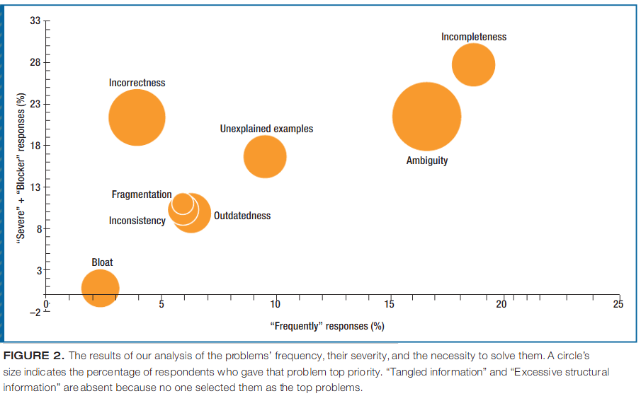

# Original Definition

Excess Structural Information Smell is an API documentation problem, in the category of "how the API is presented", first defined in a 2015 study by Uddin and Robillard:

> "The description of an element contained redundant information about the element’s syntax or structure, which could be easily obtained through modern IDEs"
>
> &#x20;       \- Uddin and Robillard (2015)

In their study, although still a problematic smell, Uddin and Robillard observed that none of the 69 developers surveyed identified this smell as one of the top problems affecting API documentation.

<figure><figcaption>
Results of the survey carried out by Uddin and Robillard. Their caption describes how "Excessive structural information" is not seen as a top problem. <em>(Image taken from the article "How API Documentation Fails")</em>
</figcaption></figure>
