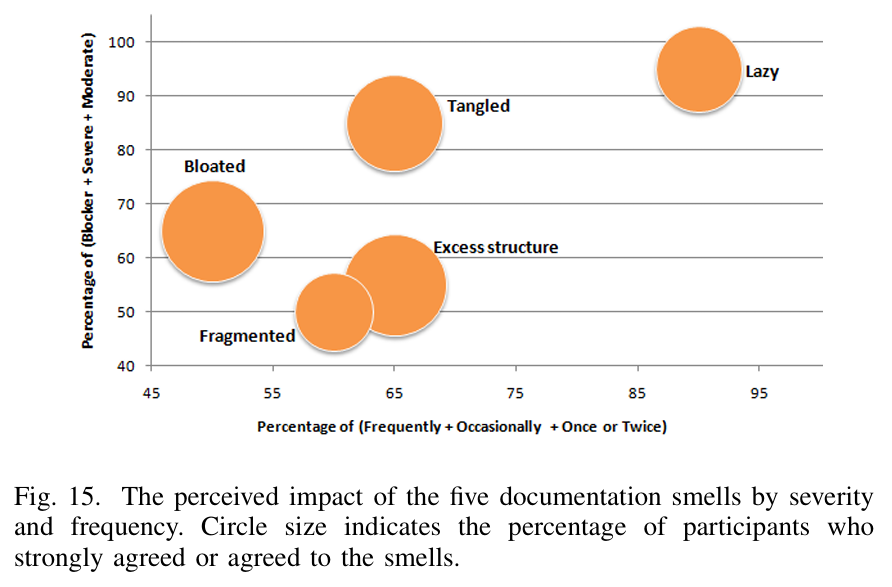
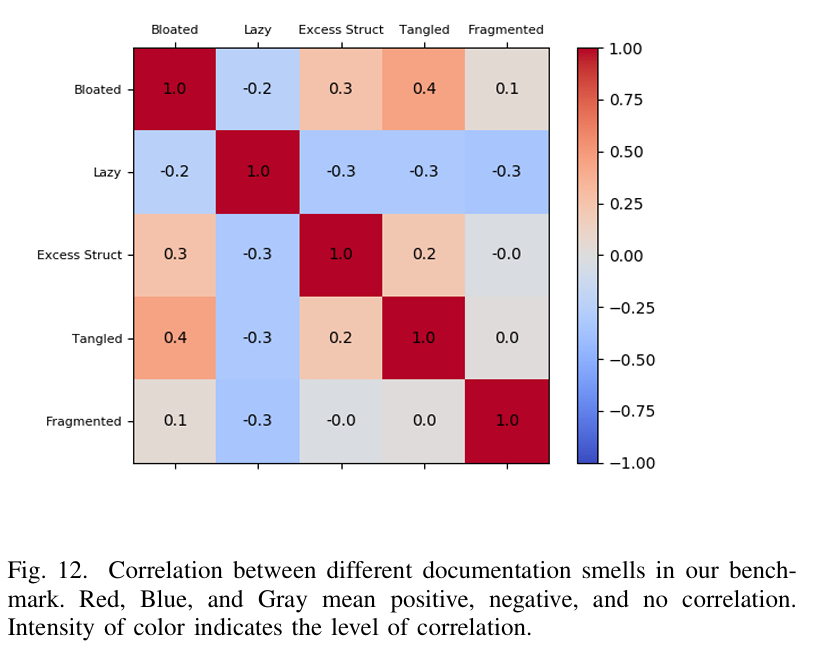

# Second Definition

In 2021, Khan et al., following the footsteps of the previous study, conducted a similar survey on API Documentation Smells, with a more robust definition for the Excess Structural Information Smell:

> "Such a description of a documentation unit (e.g., method) contains too many structural syntax or information, e.g., the Javadoc of the java.lang.Object class. Javadoc lists all the hundreds of subclasses of the class. (...) that are quite unnecessary for the purpose of understanding and using the underlying method."
>
> &#x20;       \- Khan et al. (2021)

This new survey, conducted on 21 developers, observed that this smell was reported by 65% of the participants. Similarly to the previous study, the developers reported this smell as the second less problematic, with an impact percentage of around 55%. While it may be comparatively one of the lowest percentages, it is still a significant problem to be tackled in API Documentation.

<figure><figcaption>
Results of the study carried out by Khan et al. <em>(Image taken from the article "</em>Automatic Detection of Five API Documentation Smells: Practitioners’ Perspectives<em>")</em> 
</figcaption></figure>

Khan et al. also confirmed some correlations between Excess Structural Information Smell, namely:

* A positive correlation with the Bloated Documentation and Tangled Documentation smells
* A negative correlation with the Lazy Documentation smell

<figure><figcaption>
Correlations between API Documentation Smells, resultant of the study carried out by Khan et al. <em>(Image taken from the article "</em>Automatic Detection of Five API Documentation Smells: Practitioners’ Perspectives<em>")</em> 
</figcaption></figure>
